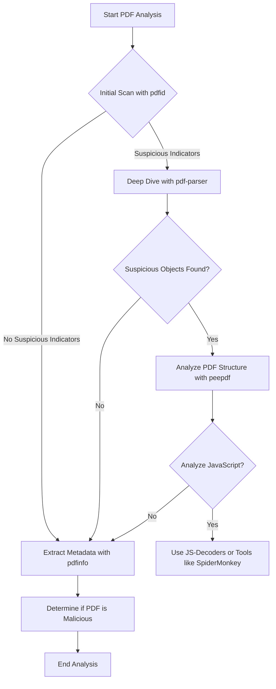

# PDF Malware Analysis Guide

This guide provides instructions on how to analyze a PDF file to determine if it is malicious. The steps include using various open-source tools to inspect the content, structure, and behavior of the PDF file.

## How PDFs Can Be Used for Malware

PDFs are commonly exploited to deliver malware due to their wide usage and ability to contain various types of content. Below are some common ways PDFs can be used for malicious purposes:
- **Embedded JavaScript**: PDFs can contain embedded JavaScript, which can be used to execute malicious scripts when the PDF is opened. This can lead to drive-by downloads, system exploitation, or further malware installation.
- **Malicious Links**: PDFs often include links to external resources. Attackers can embed malicious URLs within the document, leading to phishing sites or direct malware downloads.
- **Embedded Files**: PDFs can include other files (e.g., executables) within the document. These embedded files can be extracted and executed on the victim's machine.
- **Exploiting Viewer Vulnerabilities**: Attackers may craft PDFs to exploit vulnerabilities in the PDF viewer software, leading to remote code execution or other malicious actions without user interaction.
- **Social Engineering**: PDFs can be used to deceive users into performing actions, such as enabling macros or downloading and executing malicious files, by appearing as legitimate documents.

## Prerequisites

Before starting the analysis, ensure you have the following tools installed:
- **pdfid**: A tool to quickly check for common signs of malicious PDFs.
- **pdf-parser**: A tool to analyze the structure of a PDF file.
- **peepdf**: An advanced tool for analyzing PDFs.
- **pdfinfo**: A tool to extract metadata from a PDF.
- **JS-Decoders** (optional): Tools like SpiderMonkey or pdfstreamdumper for JavaScript analysis within PDFs.

## Steps to Analyze a PDF



### 1. Initial Scan with pdfid

The first step is to perform a quick scan of the PDF using pdfid to identify potential risks.

```bash
pdfid <filename.pdf>
```

Key indicators:
* /JS, /JavaScript, /OpenAction, and /AA tags might indicate the presence of embedded JavaScript.
* /Launch, /URI, or /EmbeddedFile tags may suggest potentially malicious actions or embedded files.

### 2. Deep Dive with pdf-parser

After identifying potential risks, use pdf-parser to further investigate the suspicious objects within the PDF.

```bash
pdf-parser <filename.pdf>
```

To list all objects in the PDF:

```bash
pdf-parser <filename.pdf> -s
```

To analyze a specific object (e.g., object 12):

```bash
pdf-parser <filename.pdf> -o 12
```

Key indicators:
* Look for obfuscated JavaScript, suspicious actions, or embedded files.

### 3. Analyze PDF Structure with peepdf

peepdf is a more advanced tool that allows you to interactively analyze the PDF structure and potential exploits.

```bash
peepdf <filename.pdf>
```

Within peepdf, you can explore the objects, streams, and metadata in detail:

```bash
objects
```

To analyze specific streams:

```bash
stream <object_number>
```

Key indicators:
* Look for suspicious JavaScript code or shellcode.
* Check for embedded files or unusual actions triggered by opening the document.

### 4. Extract Metadata with pdfinfo

To extract metadata and gain insights into the PDF's origin and potential manipulations:

```bash
pdfinfo <filename.pdf>
```

Key indicators:
* Unusual metadata, such as unknown authors or generators.
* Metadata fields that contain script-like content.

### 5. (Optional) Analyze JavaScript

If the PDF contains JavaScript, you might want to analyze the code further. Use a JavaScript decoder or tools like SpiderMonkey or pdfstreamdumper to deobfuscate and analyze the script.

```bash
js -f <script.js>
```

Key indicators:
* Obfuscated or encoded strings.
* Code that attempts to exploit vulnerabilities in the PDF viewer.

## Conclusion

After performing the above steps, you should have an idea of whether the PDF is malicious. If any suspicious activities, scripts, or objects are detected, the PDF should be considered potentially dangerous.

## References

- [PDF Tools](https://blog.didierstevens.com/programs/pdf-tools/)
- [DidierStevensSuite](https://github.com/DidierStevens/DidierStevensSuite/tree/master)
- [peepdf](https://github.com/jesparza/peepdf)
- [PDF_analysis](https://github.com/zbetcheckin/PDF_analysis)
